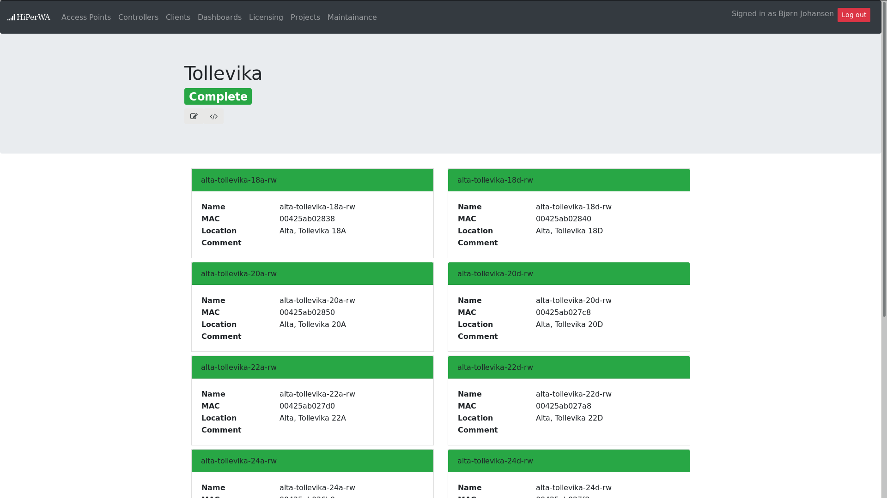

title: Large scale collection of information over SNMP from a wireless network
layout: true

---

class: middle, center
# Large scale collection of information over SNMP from a wireless network

### Bjørn Johansen <bjorn.l.johansen@uit.no>
### Uninett Trådløssamling 2017-11-20

---
#Outline
- Why
- What
- How
	- History
	- Architecture
- Current state and future plans
- Lessons learned
- Quirk
---
# Why
- Current tools
	- Slow
	- Resource demanding
	- Little customizable
	- Non-user friendly for end-users
- Potential debug/monitoring for digital exams

- Needed a problem to solve

- Goal: A system that both handles periodic collection(10-30 second intervals) and interactive triggers
---
# What
- 1st iteration
	- Basic statistics collection and WHOIS service
	- Working title TNC(TNC is Not CPI)
	- Capstone project (HiPerWa - High Performance Wireless Analytics)

- 2nd iteration
	- More collection of client and AP information and controller monitoring.
	- Decision base for manual and semi-automatic RRM
	- Master thesis

- 3rd iteration
	- Parallelization and presentation
	- End-user focus
	- Currently somewhere between 3rd and 4th iteration

---
# How
- Started as a single python script collecting data from two controllers
	- Data stored in  MYSQL/MariaDB
	- Separate python script for WHOIS(RFC812)
	- Capstone project to figure out what can be collected and what can it be used for
	- SNMP collection
		- Striping through a single field at a time
		- Complete collection time of 10-12 seconds vs 120-130 for current tool
		- Run every 5 minutes
---
# How (cont'd)
- Changed architecture to support stronger data consistency and selective/prioritized collection
	- More frequent collection
		- Dynamic adjustment of collection interval
	- Every access point and client collected individually
		- Collection of 3k APs and 10-11k Clients sequentially doesn't scale
		- Actual CPU time spend decoding SNMP information and latency to controller a factor
	- One process per controller -> Worker processes -> Worker processes with worker threads
		- Currently one thread per access point or client
- SQL(MYSQL/MariaDB) -> NOSQL(MongoDB)
	- Better for storing a wide range of devices with varying attributes

---
# Current architecture
- RabbitMQ
	- Messaging between worker processes
- MongoDB
	- Originally running on the same machine, temporarily outsourced due to resource constraints
- Each controller has its own "management" process
	- Scan for new clients/APs
		- Sent via RabbitMQ to listening worker processes
	- Collection of controller specific information
- Separate AP and Client worker processes
	- Listens for APs and clients with a specific MAC-address pattern
		- If AP or client is not currently being collected, spawn new worker thread
	- Use mac address pattern to distribute work evenly between workers
	- Can take down parts of the collection mechanism for adjustments or for testing code

---
# Data presentation
- Web portal
	- Under reimplementation
	- Twitter Bootstrap for responsive design
	- Self-service page
	- API
- WHOIS
	- Current version deprecated
	- New service under development alongside global search

---

---

---
# Scaling
- Increased kernel.pid_max
	- default 2^15 -> 2^19
- Trickery with the TCP/IP-stack
	- With 14-15k worker threads, each opening and closing database and SNMP sockets
- In the process of separating frontend(HTTP and WHOIS) and backend

---
# Lessons learned
- Presentation of data to end users is hard
- Resiliency is key, controllers fail, stop responding and sometimes serves you garbage

---
# Quirks
- Cisco WLC 5508 and usernames
	- May not respond to Cisco OID for username, but respond for old Airospace OID
- 2504 and licensing
	- Cisco WLC 2504 controllers do not conform to the MIB and need some special collection mechanism
- Shuffeling of values(name-changes)
	- Observed that controllers sometime shuffles around keys and values when responding to SNMP requests, seen as APs suddenly changing name 
- 1810W and 1815W
	- Report 3 slots, while only responding to the two first slots over SNMP

- The whole project a somewhat SNMP-expedition
---
#ASCII 0x04(EOT)
- Questions?
